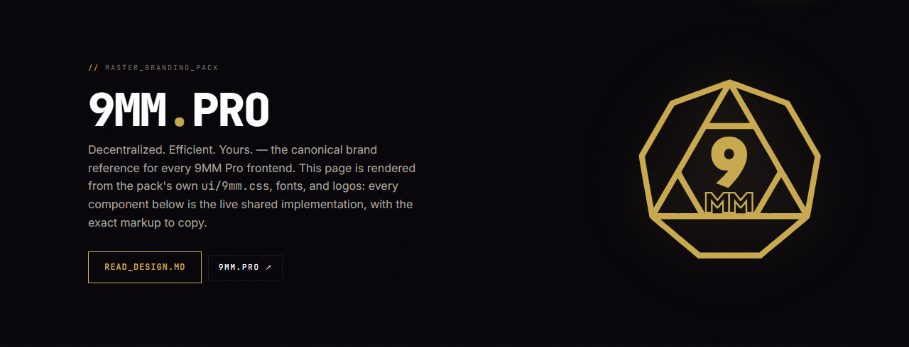
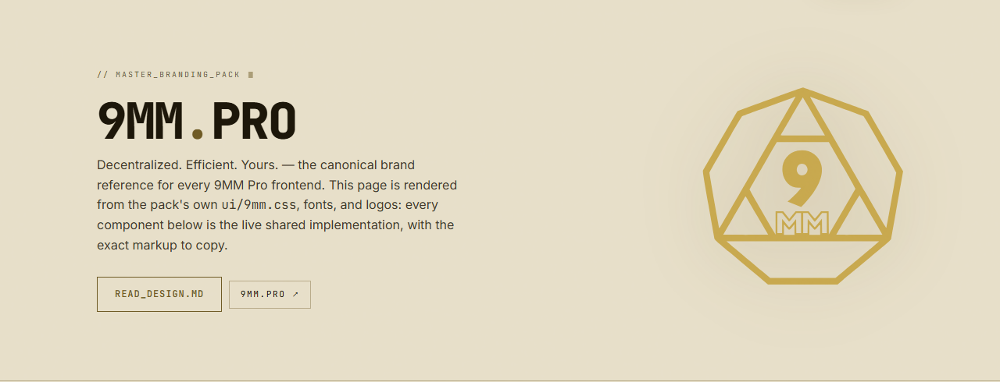

<div align="center">

<picture>
  <source media="(prefers-color-scheme: dark)" srcset="logo/svg/9mm-mark-white.svg">
  
</picture>

# 9MM<span>.</span>PRO — Branding Pack

**The single source of truth for the 9MM Pro brand and UI.**
Tokens, components, fonts, logos, favicons — one repo, every frontend.

[](CHANGELOG.md)
[](DESIGN.md)
[](index.html)

*Decentralized. Efficient. Yours.*

</div>

---

Every 9MM Pro frontend — landing, DEX, 9x, claim, XCH Terminal, tokens — pulls
its brand from this repo. Product repos **reference** it; they never keep local
copies of brand CSS. That rule exists because local copies are exactly how the
sites drifted apart before this pack existed.

| | |
|---|---|
| 📖 **[DESIGN.md](DESIGN.md)** | The brand guide: logo rules, color system, typography, components, layout/motion/z-index/accessibility specs |
| 🖥️ **[index.html](index.html)** | Live component reference — every shared class rendered with copyable markup, dark/light toggle, click-to-copy color swatches. Just open it in a browser |
| 📋 **[CHANGELOG.md](CHANGELOG.md)** + [VERSION](VERSION) | What changed since your site last synced |
| 🤖 **[CLAUDE.md](CLAUDE.md)** | Protocol for AI agents building 9MM Pro frontends |

## Preview

The component reference (`index.html`) — rendered entirely from the pack's own
tokens, fonts, and logos, so if it looks right, the pack works:

| Dark (default) | Light — aged paper (opt-in) |
|---|---|
|  |  |

## Quick start

Reference this repo from your project — git submodule recommended, or a
vendored copy pinned to a commit:

```bash
git submodule add https://github.com/9mm-exchange/branding.git branding
```

**1 · Tailwind v4 sites (the standard path)** — one import is the whole brand:

```css
/* globals.css */
@import "tailwindcss";
@import "../branding/ui/9mm.css";      /* tokens + @theme utilities + all components */
@import "../branding/fonts/fonts.css"; /* self-hosted JetBrains Mono + Inter */
```

You get the utilities (`bg-ink-950`, `text-brass`, `text-fg-muted`, `font-mono`,
`tracking-label`, …) **and** every shared component class — `.bracket-card`,
`.btn-terminal`, `.table-terminal`, `.ticker-row`, modals, toasts, tabs, badges,
loading states, and the rest. Delete any local copies of those rules from your
globals.css.

**2 · Non-Tailwind pages** — the same two imports work as plain CSS (browsers
skip the `@theme` block), or take just `tokens/colors.css` + `fonts/fonts.css`
for tokens only.

**3 · Favicons** — copy the image files + `site.webmanifest` from
[`favicon/`](favicon/) into `public/`, paste [`favicon/snippet.html`](favicon/snippet.html)
into `<head>`.

**4 · Logo** — use the SVG masters in [`logo/svg/`](logo/svg/): white on dark,
black or brass on light. Never let white-on-transparent artwork sit on a
theme-driven background (DESIGN.md §2).

**5 · Icons** — [lucide-react](https://lucide.dev) only. Sizes and conventions
in DESIGN.md §5.

## Two rules that keep the brand coherent

1. **Never copy component CSS into a project.** Import `ui/9mm.css`. If a
   component needs to change, change it *here* — every site picks it up.
2. **Dark is the default scheme on every site.** Light (aged paper) is an
   explicit, persisted toggle. No pure white anywhere, in either theme.

## Staying in sync

[`VERSION`](VERSION) + [`CHANGELOG.md`](CHANGELOG.md) track every design change:

- **MAJOR** — breaking: a class/token renamed or removed, markup edits required
- **MINOR** — new components, classes, tokens, or assets
- **PATCH** — value tweaks, doc fixes, asset regenerations

Pin the pack version in your project's CLAUDE.md (paste-ready snippet in
[CLAUDE.md](CLAUDE.md)). When starting UI work, diff your pin against `VERSION`
and read the CHANGELOG entries since — token-only changes arrive silently on
sync; MAJOR changes tell you exactly what to update.

## What's inside

```
ui/9mm.css      the canonical UI layer — tokens, @theme, base styles, every component
tokens/         colors.css (CSS custom properties) · tokens.json · tailwind-snippet.css
fonts/          JetBrains Mono (300–800 + italic) · Inter (400–700) · fonts.css · OFL licenses
logo/           svg/ traced masters (white · black · brass) · png/ renders (559 + 1024)
favicon/        .ico, PNGs, theme-aware icon.svg, maskable PWA icon, manifest, head snippet
assets/         chain icons · 9MM + PUSSY 404 token icons · 9x protocol marks · nfts/ OG collection art
social/         og-image.png (1200×630 reference card)
docs/           README preview images
DESIGN.md       the brand guide
index.html      the live component reference
```

## Brand at a glance

| | Dark (home) | Light (aged paper) |
|---|---|---|
| Background | `#08060b` ink | `#e7dfc9` manila |
| Card | `#0d0a12` | `#efe8d4` |
| Brass (accent) | `#c8a84e` | `#6e5a24` |
| Text | `#ffffff` | `#1c1609` |

**Type:** JetBrains Mono carries the brand (display, labels, data) · Inter for body copy.
**Voice:** terminal / tactical HUD — `ALL_CAPS_LABELS`, hairlines over shadows,
brackets over rounded corners, square everything.

## Notes

- The SVG logos were auto-traced from the original 559×559 PNG (no vector master
  existed). Trace verified faithful; replace if a hand-drawn vector surfaces.
- Fonts are Google Fonts builds repackaged from Fontsource — SIL OFL, license
  files included beside the woff2s. Brand artwork is proprietary to 9MM Pro.
